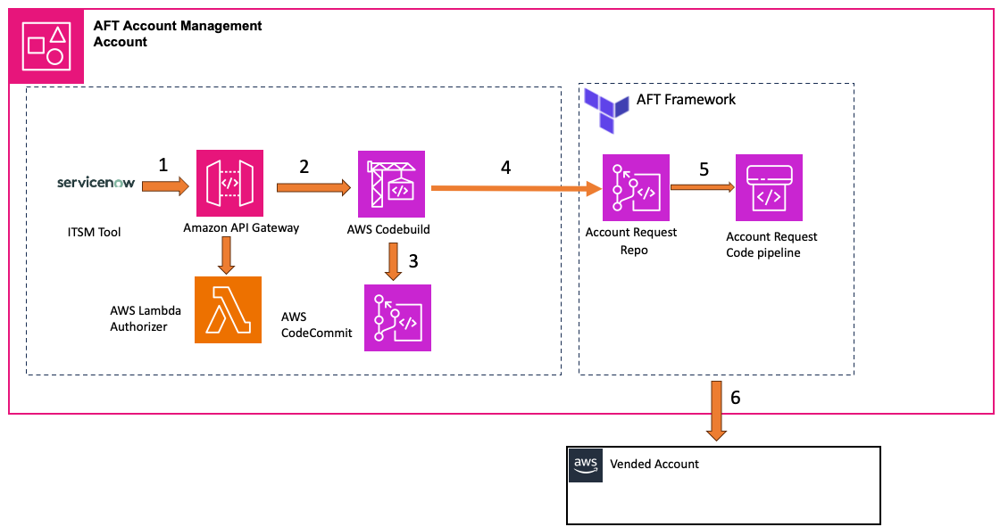
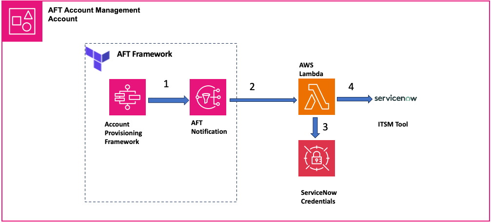

# Integrating ServiceNow with AWS Control Tower Account Factory for Terraform

This solution shows how to integrate Account factory for Terraform (AFT) with the Service now Instance to allow business teams to easily provision AWS account via Service now. 

## Solution architecture and design

### Account Vending Request

## 

1. ***Initiation from ServiceNow:*** The account vending request process starts with ServiceNow. This tool handles change management by creating a Change Request (CR) ticket for the account provisioning request.
2. ***Triggering AWS API Gateway:*** Upon initiation of the change ticket for the account provisioning request, AWS API Gateway is invoked. This API Gateway is configured to have service integration with AWS CodeBuild, allowing for a seamless connection between the initiation of a request in ServiceNow and its processing in AWS.
3. ***Generation of Terraform Scripts:*** CodeBuild then generates the necessary Terraform scripts and configuration files for the AFT based on the input payload from ServiceNow. These scripts and configurations are merged into the Account Request Repository, which is part of the AFT framework.
4.	***AFT Framework Components:***
    1. ***Account Request Repo:*** This repository, as mentioned, holds the Terraform code and “tfvars” configurations for account vending requests.
    2.  ***Account Request Code Pipeline:*** This component processes the Terraform scripts that define the AWS account configurations, playing a  crucial role in the actual account creation process within the AFT framework.
5.	***Creation of Vended Account:*** The AWS account is fully set up and configured according to the specifications detailed in the Terraform scripts. This account is processed and provisioned through the AFT Framework, resulting in a ready-to-use AWS account tailored to the specifications outlined in the initial ServiceNow change request.

### Account Vending Response

## 

1. ***Core Components of AFT Framework for Account Creation Response:***
    1. ***Account Provisioning Framework:*** This component in the AFT framework is tasked with creating and setting up new AWS accounts based on predefined templates and policies.
    2. ***AFT Notification:*** After an account is created, notifications are managed via an Amazon Simple Notification Service (SNS) topic. This component is essential for informing relevant stakeholders about the status and details of the newly provisioned account.
2.	***Lambda Function and SNS Topic Integration:*** A Lambda function is subscribed to the AFT Notification SNS topic. This function is triggered to read the status and details of the account provisioning from the notifications.
3.	***Credential Management and AWS Secrets Manager:*** The credentials required for the Lambda function to communicate with the ITSM tool are securely stored in AWS Secrets Manager.
4.	***Lambda Function Response to ServiceNow:*** The Lambda function, upon retrieving account details and status from the AFT notification, sends this information back to the ServiceNow. The ServiceNow should be configured to recognize this response and automatically close the request in its workflow.

## Prerequisites

* An AWS Identity and Management (IAM) account with administrator privileges for the services used in this solution.
* Setting up Landing Zone using AWS Control Tower adhering to Multi account best practices. 
* Setup Account Factory for terraform on the AFT Management account using the steps specified at  deploy AWS Control tower Account factory for terraform (AFT) documentation.
* Configure the AWS credentials of the AFT management account in the terminal. Install the [AWS CDK Toolkit](https://docs.aws.amazon.com/cdk/v2/guide/getting_started.html). If you’re unfamiliar with the steps, then review the [AWS CDK workshop](https://cdkworkshop.com/) for help. 
* ServiceNow Instance with the Service now Form and workflow setup to invoke the API Gateway and receive response back from Lambda function. The steps to set this up for the form being used for this blog can be found in the [repository](./Snow_form_setup/)

## Deployment Steps 

1. Clone the repository and bootstrap the application in your local machine by running the following AWS Command Line Interface (AWS CLI) commands from a terminal window.

```
git clone <repo url> aft-account-vending
cd aft-account-vending
python3 -m venv .venv 
source .venv/bin/activate 
pip install -r requirements.txt
```

2.	Update cdk.json with your AFT Account repository name, Service now Endpoint URL, AFT Account Request Repository Committer email and Name and then deploy the aft-account-integration Application

```
cdk bootstrap aws://<AFT Management Account>/<AFT Primary Region>
cdk deploy --require-approval=never
```

3. The application is successfully deployed you will see the API Gateway URL and AFT integration Repository on the output. The API Gateway URL should be used for the Service now Integration, AFT integration repository will be required to host the configuration files that will be used by the AWS CodeBuild and the Secrets Manager should be updated with the ServiceNow username and password. 

4. Update the Secrets Manager created in the previous step with the ServiceNow username and the password. 

5. Clone the CodeCommit repository (aft_integration_pipeline) created in the previous step.

```
git clone codecommit::us-east-1://aft_integration_pipeline
```

6. Copy all the files from the [aft_build_scripts](https://gitlab.aws.dev/rajendbc/aft-integration/-/tree/main/aft_build_scripts) folder present in the aft-account-integration repository to the cloned repository. Update the config_map.json based on your AWS Organization setup. 

7. Add the code to the repository by running the following commands:

```
git add .
git commit -m "Initial AFT Integration commit"
git push 
```

## Cleanup 

Destroy the aft-account-integration application by running the following command

```
cdk destroy
```
## Authors

Gopinath Jagadesan - Senior Solutions Architect - gopinjag@amazon.com 

Suresh Poopandi - Principal Solutions Architect - GLS - ssurpo@amazon.com

Ryan Griffin - Senior Cloud Infrastructure Architect - ryandg@amazon.com

Balu Rajendran - DevOps Consultant - rajendbc@amazon.com

## Security

See [CONTRIBUTING](CONTRIBUTING.md#security-issue-notifications) for more information.

## License

This library is licensed under the MIT-0 License. See the LICENSE file.
